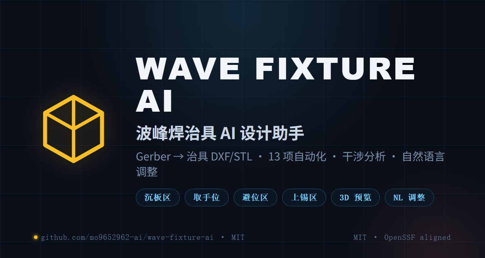
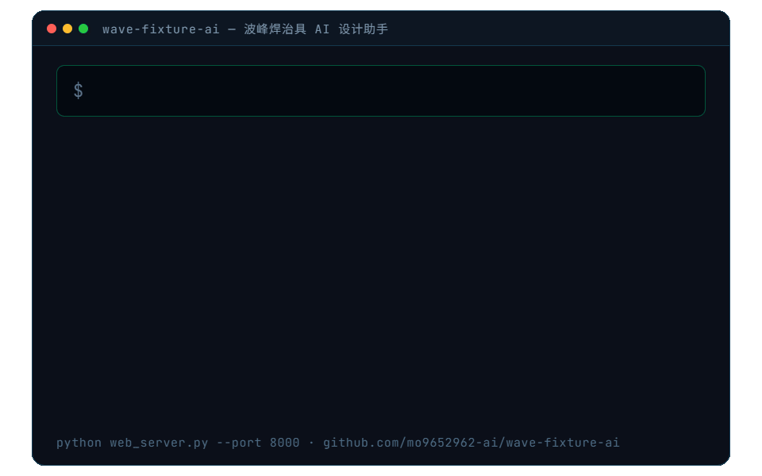

<div align="center">

  

  # WAVE FIXTURE AI

  **Gerber 进 · 治具工程图出 · 21 项自动化 · 会听人话的 CAD 助手**

  **wave-fixture-ai 把波峰焊治具设计从手工描图变成一条命令：拖入 PCB Gerber 文件，自动生成沉板区、取手位、避位区、上锡区、压扣孔、定位销与治具外形，输出 DXF/STL/GLB；支持 3D 预览、元件干涉分析与自然语言参数调整（「避位区外扩1mm」等 29 参数确定性解析）。**

  <p>
    <a href="README.en.md">English</a>
    ·
    <a href="#-在-ci-里用github-action">🤖 GitHub Action</a>
    ·
    <a href="llms.txt">📄 llms.txt (AI 直读)</a>
    ·
    <a href="VALIDATION.md">🧪 真实世界验证 (16 缺陷)</a>
    ·
    <a href="#-api-端点">🔌 API</a>
    ·
    <a href="LICENSE">MIT</a>
  </p>

  <p>
    <a href="https://github.com/mo9652962-ai/wave-fixture-ai/actions/workflows/ci.yml"></a>
    
    
    
    
    
    <a href="VALIDATION.md"></a>
    <a href="LICENSE"></a>
    <a href="https://securityscorecards.dev/viewer/?uri=github.com/mo9652962-ai/wave-fixture-ai"></a>
  </p>
</div>

<div align="center">
  
</div>

<div align="center">
  
  <p><sub>▲ 21 项自动化 · DXF / STL / GLB / CNC G 代码 / 生产报告交付 · Web 界面或命令行</sub></p>
</div>

<div align="center">

### ⭐ 如果 wave-fixture-ai 对你有帮助，点个 Star 就是最大的支持

[](https://github.com/mo9652962-ai/wave-fixture-ai/stargazers)
[](LICENSE)
[](https://github.com/mo9652962-ai/wave-fixture-ai/actions)

[](https://star-history.com/#mo9652962-ai/wave-fixture-ai&Date)

</div>

## ✨ 21 项自动化

| 步骤 | 功能 | 状态 |
|:---|:---|:---|
| 1 | Gerber 上传识别（KiCad 10 兼容）| ✅ gerbonara + 正则回退 |
| 2 | 沉板区（外形外扩 0.2mm + R1.85 清角）| ✅ |
| 3 | 取手位（左右 20×40mm，重叠 1mm，R2 倒角）| ✅ |
| 4 | 压扣螺丝孔（Φ3.4，四角，距边 10mm）| ✅ |
| 5 | 定位销（DRL 钻孔内缩 0.1mm）| ✅ |
| 6 | 避位区（BOT+TOP 双面贴片包围 + 自动合并）| ✅ ESP32 板实测 |
| 7 | 上锡区（TOP 插件焊脚包围 + R2）| ✅ |
| 8 | 盖板弹力柱孔（丝印中心 Φ2.45）| ✅ |
| 9 | 治具外形（外扩整数化 + R5 + 轨道虚线 + 挡锡条）| ✅ |
| 10 | 输出治具 DXF（8 图层）| ✅ |
| 11 | **3D 预览**（STL/GLB 导出 + 浏览器旋转查看）| ✅ |
| 12 | **干涉分析**（元件 vs 治具：2D 覆盖 + 3D 布尔双层判定）| ✅ |
| 13 | **自然语言调整**（「避位区外扩1mm」等 29 参数）| ✅ |
| 14 | **DRC 生产安全门禁**（39 规则 · 四级严重度 · 每条带出处；未过 → 只出水印预览）| ✅ |
| 15 | **Golden Sample 回归验证**（IoU≥0.9 · Hausdorff≤0.5mm · 圆孔双向 best-match）| ✅ |
| 16 | **人工 Review 闭环**（缺数据/低置信度挂起 → 工程师确认 → SHA 绑定 + 审计日志）| ✅ |
| 17 | **定位销打分选点**（孔径窗口 / NPTH / 靠边权重 + 对角最大跨距）| ✅ |
| 18 | **内凹拐角狗骨头清角**（角平分线外移刀路 · 狗骨头/T-bone/角孔 · DXF「清角刀路」图层）| ✅ |
| 19 | **拼版阵列**（N×M 多片一治具 · 片间距挡锡墙 · 拼版后避位/上锡/销全量复制）| ✅ |
| 20 | **材料预设与成本估算**（Durostone/Ricocel/FR-4/铝 · 重量/材料费/工时费）| ✅ |
| 21 | **CNC G 代码直出 + 生产工单报告**（钻孔/挖腔/外形落料全工序 · .nc 交付 · Markdown 工单）| ✅ |

## 🚦 DRC 生产安全门禁（工业级核心）

治具出图前跑 39 条设计规则检查，**存在 blocking / error 时导出的 DXF 自动打水印**（`PREVIEW`），
禁止直接送 CNC 生产——这是"设计稿"与"生产件"之间的最后防线。

| 级别 | 含义 | 例 |
|:---|:---|:---|
| `blocking` | 几何无效，不能生产 | 沉板区超出治具外框、外形自交 |
| `error` | 工艺冲突，需修正 | 定位销落入避位区、压扣孔压到板边元件、治具超传送带极限（508×762mm）、治具短边超波峰焊轨距（默认 330mm）|
| `warning` | 建议优化 | 定位销/压扣少于 2 个、开口宽 <3.8mm（Macaos）、沉板壁厚 <1.5mm（APTPCB）、拼版间距 <3mm |
| `info` | 提示 | — |

每条规则都带 **出处**（竞品逆向框架 + Macaos / AGICORP / APTPCB / PCBSync / MB Manufacturing 的 DFM 指南），
不是拍脑袋的阈值。QA 闭环配套：

- **Golden Sample 回归**：`golden.py` 支持导出几何基准并断言 IoU ≥0.9、Hausdorff ≤0.5mm、圆孔位置/半径误差；
- **人工 Review**：缺层/低置信度**不自动猜**，挂起 mandatory review；工程师确认后写入
  `layer_mapping.json`（绑定 geometry SHA256——几何一变确认自动过期），pending 状态阻断生产放行。

## 🚀 快速开始（Web 界面，推荐）

```bash
# 安装（或 pip install -e . 后用 wave-fixture-ai 命令）
pip install -e .

wave-fixture-ai --port 8000
```

浏览器打开 **http://localhost:8000**，使用流程：

```
1. 拖入 Gerber 文件（.gbs/.gts/.gbl/.gtl/.gm1/.drl 等，可多选）
   建议包含：B_Mask + F_Mask + Edge_Cuts + B_Cu + F_Cu + .drl
2. 点「🚀 生成治具」→ 预览 2D + 下载 DXF/PNG
3. 点「🧊 生成 3D」→ 3D 旋转预览 + 下载 STL/GLB
4. （可选）干涉分析：再拖入 KiCad 工程文件 .kicad_pcb → 报告避位不足的元件
5. （可选）自然语言调整：输入如「避位区外扩1mm」→ 重新生成
```

## 🤖 在 CI 里用（GitHub Action）

在 PR 时自动为 PCB 生成波峰焊治具并跑 DRC 生产门禁——**可制造性问题在 PR 阶段暴露**，
防止把不可焊的板送去打样：

```yaml
name: drc
on: [pull_request, push]
jobs:
  fixture-drc:
    runs-on: ubuntu-latest
    permissions:
      contents: read
    steps:
      - uses: actions/checkout@v4
      - uses: mo9652962-ai/wave-fixture-ai@main
        with:
          gerber-dir: gerber/           # 你的 Gerber 产物目录
          severity-threshold: error     # error/blocking 问题让 CI 失败
```

产出：`fixture.dxf`（通过则为生产版，未过自动带 `PREVIEW` 水印）+ `drc-report.json`
自动上传为 `fixture-artifacts`。详见 [action.yml](action.yml)。本仓库 CI 每次 push 都在
用它审计自己的真实板用例（dogfood）。

## ⌨️ 命令行方式

```bash
# Phase 1（沉板区/取手位/压扣孔/定位销）
python fixture_phase1.py <gerber_dir> -o output/fixture.dxf

# Phase 2 完整（+避位区/上锡区/盖板/治具外形）
python fixture_phase2.py <gerber_dir> -o output/fixture-full.dxf

# 干涉分析（需 .kicad_pcb）
python -c "
from interference import parse_kicad_pcb, analyze_interference
comps = parse_kicad_pcb('board.kicad_pcb')
reports = analyze_interference('output/fixture.stl', comps)
"
```

## 🔌 API 端点

| 端点 | 功能 |
|:---|:---|
| `POST /api/generate` | 上传 Gerber → DXF + PNG |
| `POST /api/generate3d` | 上传 Gerber → 3D 治具（STL + GLB）|
| `POST /api/adjust` | 自然语言调整 → 重新生成 |
| `POST /api/interference` | 干涉分析（需含 .kicad_pcb）|
| `GET /dl/{file}` | 下载生成的文件 |

## 🔬 干涉分析说明

- 需要 **.kicad_pcb** 文件（Gerber 只有焊盘几何，无元件高度信息）
- 判定规则：元件盒在避位区覆盖 <85% 或 与治具 3D 重叠 >5mm³ → 报干涉
- 插件（PinHeader/Connector/USB 等）自动跳过（贯穿治具由「上锡区」处理）

## 💬 自然语言调整示例

```
避位区外扩1mm           → avoid_pad_extra: 0.3 → 1.3
沉板区外扩0.5mm          → sink_expand_mm: 0.2 → 0.7
盖板孔径改3mm            → cap_hole_r: 2.45 → 3.0
左右外扩加大20mm         → ext_left_right: 20.0 → 40.0
```

> 规则解析（确定性，不用 LLM）——工程参数调整要精确可复现。

## 🧰 技术栈

- **gerbonara** — Gerber/Excellon 解析（层自动识别 + KiCad10 G85 正则回退）
- **shapely** — 几何运算（外扩/倒角/凸包包围/坐标变换）
- **ezdxf** — DXF 输出
- **trimesh + manifold** — 3D 拉伸/布尔
- **fastapi + uvicorn** — Web 服务
- **three.js** — 前端 3D 渲染（ES module）

## 🏭 企业级交付（对标商业治具软件）

对标 Macaos Solder Pallet Designer（€1,500/年模块）的交付闭环，wave-fixture-ai 补齐四件企业级能力：

### 拼版阵列（Panelization）
小板一治具多片：界面输入 列×行 + 片间距，沉板/避位/上锡/定位销/狗骨头全量按阵列复制，
片间距挡锡墙默认 5mm（行业下限 3mm，低于阈值触发 DRC `PANEL_GAP_TOO_SMALL`）。

### 材料预设与成本估算
| 材料 | 密度 g/cm³ | 耐温 | 特性 | 适用 |
|:---|:---|:---|:---|:---|
| **Durostone 合成石** | 1.90 | 280°C | ESD 静电耗散 · 行业事实标准 | 双波/大批量 |
| Ricocel 合成石 | 1.85 | 280°C | Durostone 同类竞品 | 性价比路线 |
| 高 Tg FR-4 | 2.10 | 180°C | 低成本 | 打样/小批量 |
| 铝合金 6061 | 2.70 | 400°C | 高导热长寿命（需防挂锡） | 重载 |

自动输出：毛坯板厚吸附（向上取档）→ 重量估算 → 材料费 + 机加工费 → **报价参考**。
数据出处：Röchling 产品页 / Noves-China 板厚规格 / PCBSync 材料对比（见 `materials.py` 头注）。

### CNC G 代码直出（.nc）
DXF 之外直接交付机床可执行程序（RS-274，G21 mm / G90 绝对 / G54 / 换刀 M6 / M30 收尾）：

1. **钻孔组**：定位销孔按孔径分组自动换刀，分段啄钻；
2. **挖腔组**：避位/上锡/盖板孔（螺旋铣孔）/沉板槽（板厚+0.3mm）/取手位——行距光栅粗铣 + 每层轮廓精铣；
3. **外形落料**：刀具中心内缩一个刀径，切边落在治具边界。

进给/转速/层深/行距按材料预设给出安全默认值（合成石低进给高转速 + 强制吸尘提示），
程序头注释材料/板厚/刀具表，尾部附加工估时（本页示例真实板 39.2 min）。

### 批量作业（YAML 作业规格，KiBot 惯例）
```yaml
batch: "2026-W40 空调主板批"
defaults: { material: durostone, pallet_thickness: 10 }
jobs:
  - { name: aircon-main, gerber_dir: cases/case_002_aircon_kicad }
  - { name: stm32-carrier, gerber_dir: cases/case_003_stm32_4layer, panel_cols: 2 }
```
`python batch_run.py job.yaml` 一条命令产出整批 DXF/G 代码/工单 + 批次汇总，
单作业失败不中断批次（退出码可直接当 CI 门禁）。

### 波峰焊工艺窗口（作业指导书）
工单内置工艺参考窗口并做**材料-工艺交叉校验**：有铅 Sn63Pb37 锡炉 260±5°C/接触 2-5s、
无铅 SAC305 255-265°C/接触 4-8s（出处 Yint/Kester/Highqualitypcb，见 `process.py`）；
治具底面直接过波峰——材料耐温 <255°C（如高 Tg FR-4 180°C）触发 DRC `MATERIAL_TEMP_WINDOW` 警告。

### 生产工单报告（Markdown）
一次生成可归档/可传阅的 `*-report.md`：治具规格（含拼版）→ 材料与成本 → CNC 程序摘要 →
DRC 结论 → 干涉汇总 → 交付物清单，每项带数据出处。

> 真实板示例（case_003，2×1 拼版）：治具 130×105mm · Durostone 10mm · 毛坯 0.356kg ·
> 材料费 ¥149.5 + 加工费 ¥78.4 ≈ **¥227.9/套**

## 🧪 真实板验证（Golden Cases）

两类**真实生产板**的端到端回归基准（`cases/`）：

| Case | 来源 | 规格 | 覆盖 |
|:---|:---|:---|:---|
| `case_001_espmh` | EasyEDA 双排插针板（竞品 production sample + 人工基准） | 25.654×48.26mm · 31 钻孔 · 仅外形层 | 格式兼容（GBR/GER/GKO 三份等价外形）、微缺口闭合、无焊盘层时不凭空生成上锡区 |
| `case_002_aircon_kicad` | KiCad 空调板（含 B_Cu/B_Mask/Edge_Cuts 全层） | 100×80mm · 169 钻孔 · 5 种孔径 | KiCad 命名规范、大规模钻孔、真实避位/上锡区（20/24 个）、销径告警、3D 干涉判定 |
| `case_003_stm32_4layer` | **circuit-agent 生成的 4 层板**（跨仓/跨工具素材） | 37×37mm · 12 钻孔 · 含 3.2mm 安装孔 | **跨 AI-EDA 工具兼容性**、合格销径走打分正常路径、DRC 全绿正例 |

```bash
uv run pytest -q --cov --cov-fail-under=80    # 130 测试 · 覆盖率 84%（CI 棘轮 80）
uv run pytest tests/test_golden_case*.py -v    # 25 项真实板黄金断言
```

| 测试层 | 文件 | 覆盖内容 |
|:---|:---|:---|
| **真实板黄金**（25） | `test_golden_case00*.py` | 三来源板的几何精确性/设计规则/跨工具兼容 |
| **API 契约**（13） | `test_web_api.py` | 全部 7 个端点的字段契约、错误路径、产物可下载 |
| **解析健壮性**（8） | `test_drill_parsing.py` | METRIC/INCH 单位推断、英寸换算、G85 多孔、去重 |
| **3D 构建**（8） | `test_fixture_3d.py` | 布尔差集体积校验、失败告警、STL/GLB 导出 |
| **导出与编排**（5） | `test_phase1_export.py` | DXF 图层契约、孔为圆实体、无外形不产出 |
| **安全**（5） | `test_web_download_security.py` | 路径穿越拒绝、同名前缀目录、cwd 变化 |
| **模块单元**（66） | 其余 | DRC 规则/Golden/Review/销选点/几何/NL 调整 |

| 断言类别 | 内容 |
|:---|:---|
| 几何精确性 | 板尺寸/面积/钻孔数与人工基准**精确匹配**（偏差 0.000） |
| 设计规则 | 治具外形 =(板+2×外扩) 向上取整 5mm；压扣孔必在沉板区**外**；销径 ≥1.5mm |
| 工程约束 | 在传送带极限内；治具完整包含沉板区 |
| 门禁语义 | 无 blocking/error 才放行；无焊盘层不凭空生成上锡区 |

> 端到端跑通的过程修掉了 **11 个真实缺陷**（层名兼容 / overrides 语义 / 同层多文件 /
> 微缺口闭合 / 压扣孔位置 / 定位销未筛选 / 销径规则 / matplotlib 依赖 / 前端门禁未渲染 /
> **干涉判定 OR→AND 误报** / **板框 gr_line 解析**）——**单测 52 全绿时仍未被发现，
> 只有真实数据、真实浏览器与黄金对比能暴露**。方法论已沉淀为 `real-world-validation` 技能。
>
> 3D 干涉分析在真实板（36 元件）上的输出：报出的大体积元件（继电器 1886–2260mm³、
> 数码管 3163mm³）避位覆盖仅 0.04–0.60，是**真实设计缺陷**（大件落在避位区外会被治具压到）。

## License

MIT
